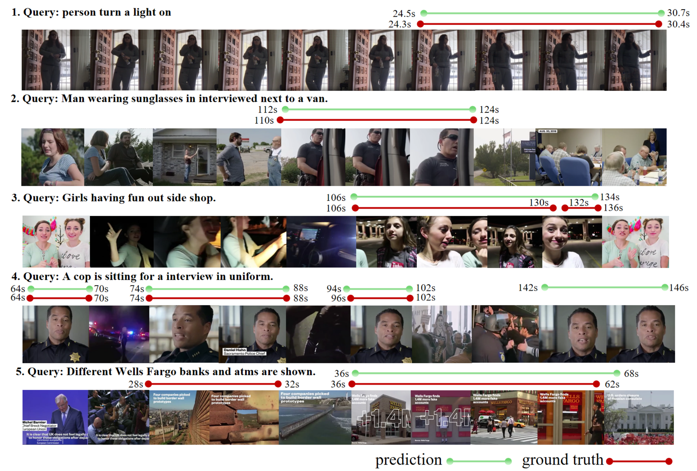
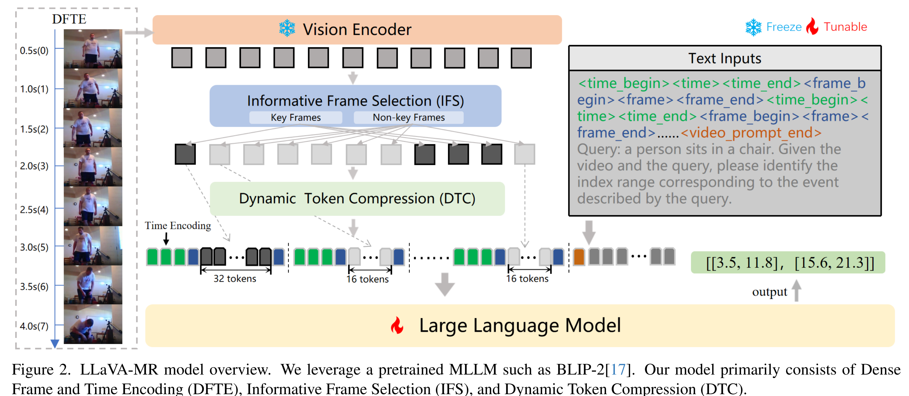

# LLaVA-MR: Large Language-and-Vision Assistant for Video Moment Retrieval

> **[LLaVA-MR: Large Language-and-Vision Assistant for Video Moment Retrieval](https://arxiv.org/pdf/2411.14505)**[ [arXiv]](https://arxiv.org/pdf/2411.14505) 

> *<sup>1</sup>Peking University, <sup>2</sup>Tencent YouTu Lab, <sup>3</sup>University at Albany, <sup>4</sup>Zhejiang University*

**⚡If you have any questions, please contact swordli@tencent.com.**. 

```
@article{lu2024llava,
  title={LLaVA-MR: Large Language-and-Vision Assistant for Video Moment Retrieval},
  author={Lu, Weiheng and Li, Jian and Yu, An and Chang, Ming-Ching and Ji, Shengpeng and Xia, Min},
  journal={arXiv preprint arXiv:2411.14505},
  year={2024}
}
```

## 📌 What is This paper About?

<p align="center">
    
</p>


Multimodal Large Language Models (MLLMs) are widely used for visual perception, understanding, and reasoning. However, long video processing and precise moment retrieval remain challenging due to LLMs’ limited context size and coarse frame extraction. We propose the Large Language-and-Vision Assistant for Moment Retrieval (LLaVA-MR), which enables accurate moment retrieval and contextual grounding in videos using MLLMs. LLaVA-MR combines Dense Frame and Time Encoding (DFTE) for spatial-temporal feature extraction, Informative Frame Selection (IFS) for capturing brief visual and motion patterns, and Dynamic Token Compression (DTC) to manage LLM context limitations. Evaluations on benchmarks like Charades-STA and QVHighlights demonstrate that LLaVA-MR outperforms 11 state-of-the-art methods, achieving an improvement of 1.82% in R1@0.5 and 1.29% in mAP@0.5 on the QVHighlights dataset. Our implementation will be open-sourced upon acceptance.


### Architecture and Training
<p align="center">
    
</p>
